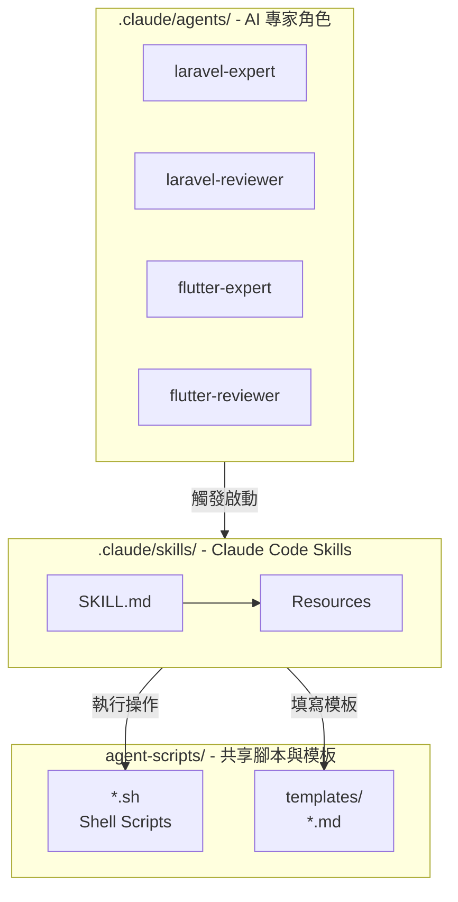
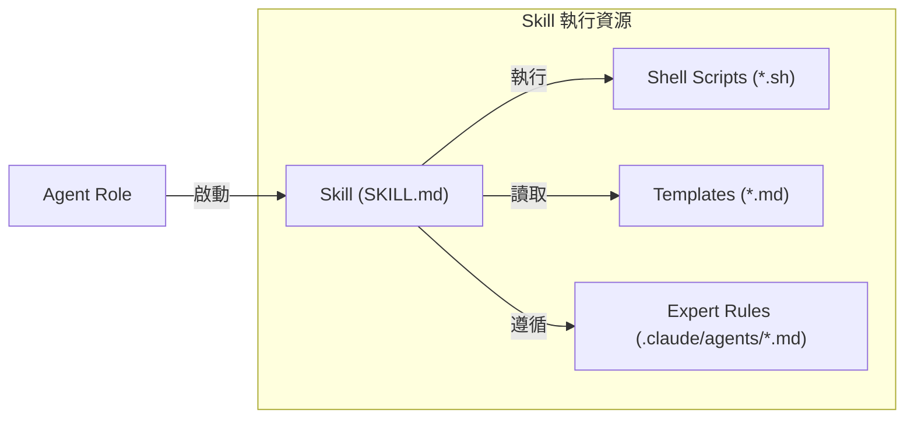
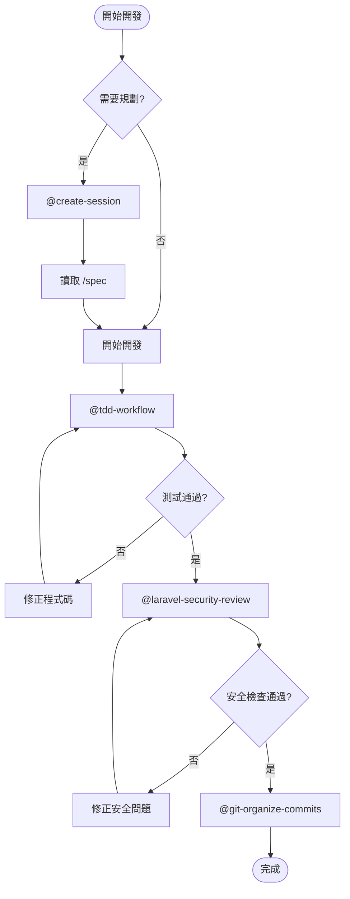

# Claude Code 系統配置

本目錄包含 Claude Code AI Agents 與 Skills 配置，用於 Q03 專案開發。

## 📁 目錄結構

```
.claude/
├── README.md                          # 本文件 (系統總覽)
├── agents/                            # AI 專家角色
│   ├── README.md                      # 導覽與概述
│   ├── AGENT-STRUCTURE.md             # 建立指南
│   ├── CHANGELOG.md                   # 變更歷史
│   ├── laravel-expert.md              # Laravel 開發
│   ├── laravel-reviewer.md            # Laravel 審查
│   ├── flutter-expert.md              # Flutter 開發
│   └── flutter-reviewer.md            # Flutter 審查
│
└── skills/                            # 可執行工作流程
    ├── README.md                      # 導覽與概述
    ├── SKILL-STRUCTURE.md             # 建立指南
    ├── CHANGELOG.md                   # 變更歷史
    ├── create-session/                # 新建 Session
    ├── tdd-workflow/                  # TDD 循環
    ├── test-planning/                 # 測試規劃
    ├── git-organize-commits/          # Git 整理
    ├── laravel-security-review/       # 安全審查
    ├── laravel-performance-review/    # 效能審查
    ├── flutter-openapi-generator/     # OpenAPI 生成
    ├── flutter-performance-review/    # 效能審查
    ├── flutter-platform-integration/  # 平台整合
    ├── flutter-security-review/       # 安全審查
    └── react-best-practices/          # React 最佳實踐
```

## 📚 Agents vs Skills

| 特性 | Agents | Skills |
|------|--------|--------|
| **觸發** | 自動 (隱式) | 手動呼叫 |
| **用途** | AI 角色/專業背景 | 具體工作任務 |
| **結構** | 單一 `.md` | `SKILL.md` + resources |
| **使用** | 自動檢測 | `/skill-name` 指令 |
| **範例** | 提及 "API" → `laravel-expert` 啟動 | `/tdd-workflow` 開始 TDD |

## 快速導覽

### 🤖 Agents (自動觸發)
AI 專家角色根據對話內容自動啟動，詳見 [agents/README.md](agents/README.md)

- **Laravel**: `laravel-expert` (開發), `laravel-reviewer` (審查)
- **Flutter**: `flutter-expert` (開發), `flutter-reviewer` (審查)

### ⚡ Skills (手動呼叫)
可執行的工作流程，使用 `/skill-name` 格式呼叫，詳見 [skills/README.md](skills/README.md)

**關鍵 Skills**:
- 📝 `/tdd-workflow` - Red-Green-Refactor 循環
- 🧪 `/test-planning` - 測試規劃與設計
- 📋 `/git-organize-commits` - Git 提交整理
- 🆕 `/create-session` - 新建開發 Session
- 🔒 `/laravel-security-review` - Laravel 安全審查

## 🏗️ 系統架構



## 🔄 資源調用模式



## 📋 開發流程整合



## 💡 設計原則

- **單一職責**: 每個 Agent/Skill 專注一件事
- **可組合性**: Skills 可互相整合
- **資源共享**: 參照 `agent-scripts/` 與 `agent-scripts/templates/`
- **明確觸發**: Agents 在 `description` 中清楚說明觸發條件

## 📚 相關資源

- 專案指引: [../CLAUDE.md](../CLAUDE.md)
- Docker 設定: [../laradock_setting.md](../laradock_setting.md)
- 自動化腳本: [../agent-scripts/](../agent-scripts/)
- 文件模板: [../agent-scripts/templates/](../agent-scripts/templates/)
