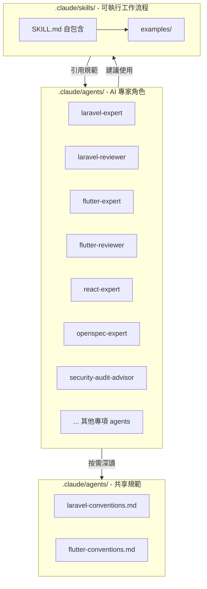
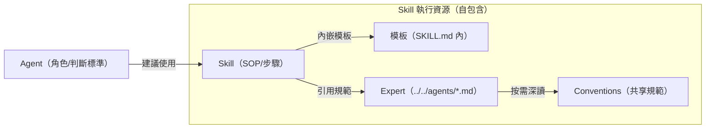
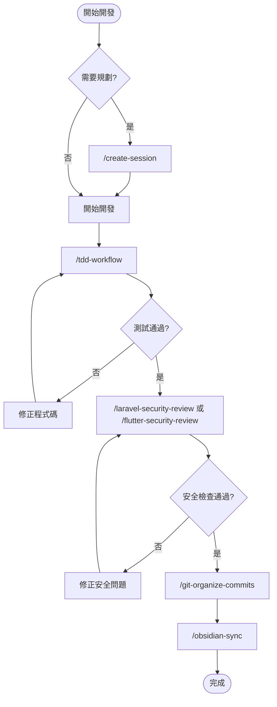

# Claude Code 系統配置

本目錄包含 Claude Code AI Agents 與 Skills 配置，用於 Q03 專案開發。

## 📁 目錄結構

```
.claude/
├── README.md                          # 本文件 (系統總覽)
├── agents/                            # AI 專家角色
│   ├── README.md                      # 導覽與概述
│   ├── AGENT-STRUCTURE.md             # 建立指南
│   ├── CHANGELOG.md                   # 變更歷史
│   ├── laravel-conventions.md         # Laravel 規範（共享）
│   ├── flutter-conventions.md         # Flutter 規範（共享）
│   │
│   │   # 開發專家
│   ├── laravel-expert.md              # Laravel 後端開發
│   ├── laravel-reviewer.md            # Laravel 程式碼審查
│   ├── flutter-expert.md              # Flutter 前端開發
│   ├── flutter-reviewer.md            # Flutter 程式碼審查
│   ├── react-expert.md                # React/TypeScript 開發
│   ├── react-reviewer.md              # React 程式碼審查
│   ├── openspec-expert.md             # OpenSpec 規格驅動開發
│   │
│   │   # 專項工具
│   ├── security-audit-advisor.md      # 資安審查顧問
│   ├── api-drift-detector.md          # API drift 偵測
│   ├── dep-upgrade-planner.md         # 依賴升級規劃
│   ├── l10n-reviewer.md               # 多語系審查
│   ├── test-coverage-reporter.md      # 測試覆蓋率報告
│   └── agent-teams-guide.md           # Agent Teams 使用指南
│
└── skills/                            # 可執行工作流程
    ├── README.md                      # 導覽與概述
    ├── SKILL-STRUCTURE.md             # 建立指南
    ├── CHANGELOG.md                   # 變更歷史
    │
    │   # 開發流程
    ├── create-session/                # 新建開發 Session
    ├── tdd-workflow/                  # TDD 循環
    ├── test-planning/                 # 測試規劃
    ├── update-changelog/              # 更新 CHANGELOG
    ├── session-to-openspec/           # Session 轉 OpenSpec change
    │
    │   # Git 管理
    ├── git-organize-commits/          # Git 提交整理
    │
    │   # 程式碼審查
    ├── laravel-security-review/       # Laravel 安全審查
    ├── laravel-performance-review/    # Laravel 效能審查
    ├── flutter-security-review/       # Flutter 安全審查
    ├── flutter-performance-review/    # Flutter 效能審查
    │
    │   # 工具整合
    ├── flutter-openapi-generator/     # OpenAPI Client 生成
    ├── flutter-platform-integration/  # Flutter 平台整合
    ├── flutter-add-l10n-key/          # 新增 l10n 多語系 key
    ├── flutter-dep-audit/             # Flutter 依賴版本審查
    ├── flutter-gen-test/              # Flutter 測試骨架生成
    ├── flutter-new-feature/           # Flutter 新功能模組
    ├── react-best-practices/          # React/Next.js 最佳實踐
    ├── frontend-design/               # 前端 UI 設計
    ├── ui-ux-pro-max/                 # UI/UX 設計智能助手
    │
    │   # Obsidian 筆記庫技能
    ├── obsidian-add-cards/            # 新增 Zettelkasten 卡片
    ├── obsidian-add-devlog/           # 輕量隨記
    ├── obsidian-add-projects-session/ # 新增專案 Session
    ├── obsidian-conclusion/           # 補結論 / 解法
    ├── obsidian-dev-lookup/           # 開發前查詢
    ├── obsidian-enrich-frontmatter/   # 補齊 Frontmatter
    ├── obsidian-health-check/         # Vault 健康檢查
    ├── obsidian-ingest/               # 吸收文章並傳播反向連結
    ├── obsidian-relocate/             # 搬移筆記到指定路徑
    ├── obsidian-relocate-resources/   # 搬移筆記到 2_Resources
    ├── obsidian-split-note/           # 拆分知識與行動筆記
    ├── obsidian-sync/                 # 將對話成果同步回 vault
    ├── obsidian-synthesize-concept/   # 萃取概念節點
    └── obsidian-update-index/         # 更新專案資料夾的 _index_*.md
```

## 📚 Agents vs Skills

| 特性 | Agents | Skills |
|------|--------|--------|
| **觸發** | 自動（隱式） | 手動呼叫 |
| **用途** | AI 角色／專業身份與判斷標準 | 具體可執行的 SOP |
| **結構** | 單一 `.md`（精簡）+ 共享 conventions | `SKILL.md`（自包含）+ examples/ |
| **使用** | 自動偵測或點名 | `/skill-name` 指令 |

## 快速導覽

### 🤖 Agents（自動觸發）

詳見 [agents/README.md](agents/README.md)

| Agent | 用途 | 觸發時機 |
|---|---|---|
| `laravel-expert` | Laravel 後端開發 | 開發 API、migration、service layer |
| `laravel-reviewer` | Laravel 程式碼審查 | commit 前、重構後 |
| `flutter-expert` | Flutter 前端開發 | 偵測到 `.dart` / `pubspec.yaml` |
| `flutter-reviewer` | Flutter 程式碼審查 | commit 前、重構後 |
| `react-expert` | React/TypeScript 開發 | 偵測到 `.tsx` / React 專案 |
| `react-reviewer` | React 程式碼審查 | commit 前、重構後 |
| `openspec-expert` | OpenSpec 規格驅動開發 | `/opsx` 指令、spec 撰寫 |
| `security-audit-advisor` | 資安審查顧問 | 資安報告、nginx 設定審查 |
| `api-drift-detector` | API drift 偵測 | 後端 spec 更新後 |
| `dep-upgrade-planner` | 依賴升級規劃 | Flutter major 版本升級 |
| `l10n-reviewer` | 多語系審查 | arb 檔案比對 |
| `test-coverage-reporter` | 測試覆蓋率報告 | 找出缺少測試的模組 |
| `agent-teams-guide` | Agent Teams 使用指南 | 需要多代理協作時 |

### ⚡ Skills（手動呼叫）

詳見 [skills/README.md](skills/README.md)

**開發流程**:
- 🆕 `/create-session` - 新建開發 Session（純指令式，自包含）
- 🧪 `/tdd-workflow` - Red-Green-Refactor TDD 循環
- 📝 `/test-planning` - 測試規劃與設計
- 📋 `/update-changelog` - 從 Session 更新 CHANGELOG 並推進版本號
- 🔗 `/session-to-openspec` - 從 Flutter session 建立 OpenSpec change

**Git 管理**:
- 📋 `/git-organize-commits` - 整理變更並撰寫 Conventional Commits（支援路徑參數）

**程式碼審查**:
- 🔒 `/laravel-security-review` - Laravel 安全審查
- ⚡ `/laravel-performance-review` - Laravel 效能審查
- 🔒 `/flutter-security-review` - Flutter 安全審查
- ⚡ `/flutter-performance-review` - Flutter 效能審查

**工具整合**:
- 🔄 `/flutter-openapi-generator` - Flutter OpenAPI Client 生成
- 📱 `/flutter-platform-integration` - Flutter 平台整合（iOS/Android）
- 🌐 `/flutter-add-l10n-key` - 新增 l10n 多語系 key
- 📦 `/flutter-dep-audit` - Flutter 依賴版本審查
- 🧪 `/flutter-gen-test` - Flutter 測試骨架生成
- 🏗️ `/flutter-new-feature` - Flutter 新功能模組建立
- ⚛️ `/react-best-practices` - React/Next.js 最佳實踐
- 🎨 `/frontend-design` - 前端 UI 設計
- 🖥️ `/ui-ux-pro-max` - UI/UX 設計智能助手（50 種風格）

**Obsidian 筆記庫**:
- 📝 `/obsidian-add-cards` - 新增 Zettelkasten 知識卡片
- 📓 `/obsidian-add-devlog` - 輕量隨記（靈感、備忘、踩坑）
- 📋 `/obsidian-add-projects-session` - 新增專案 Session 紀錄
- ✏️ `/obsidian-conclusion` - 為筆記補上結論/解法
- 🔎 `/obsidian-dev-lookup` - 從筆記庫搜尋過往紀錄
- 🧹 `/obsidian-enrich-frontmatter` - 補齊 Frontmatter 欄位
- 🏥 `/obsidian-health-check` - Vault 健康檢查（孤立筆記、懸案、潛在連結）
- 📥 `/obsidian-ingest` - 吸收文章並自動傳播反向連結
- 📦 `/obsidian-relocate` - 搬移筆記到指定路徑
- 📦 `/obsidian-relocate-resources` - 搬移筆記到 2_Resources（補齊 frontmatter）
- ✂️ `/obsidian-split-note` - 拆分知識與行動筆記
- 🔄 `/obsidian-sync` - 將對話成果同步回 vault
- 🧠 `/obsidian-synthesize-concept` - 從多篇筆記萃取概念節點
- 🗂️ `/obsidian-update-index` - 更新專案資料夾的 `_index_*.md`

## 🏗️ 系統架構


```mermaid
graph TB
    subgraph Agents[".claude/agents/ - AI 專家角色"]
        LA[laravel-expert]
        LR[laravel-reviewer]
        FA[flutter-expert]
        FR[flutter-reviewer]
        RA[react-expert]
        OA[openspec-expert]
        SA[security-audit-advisor]
        Others[... 其他專項 agents]
    end

    subgraph Conventions[".claude/agents/ - 共享規範"]
        LC[laravel-conventions.md]
        FC[flutter-conventions.md]
    end

    subgraph Skills[".claude/skills/ - 可執行工作流程"]
        SK[SKILL.md 自包含]
        EX[examples/]
        SK --> EX
    end

    Agents -->|按需深讀| Conventions
    Agents -->|建議使用| Skills
    Skills -->|引用規範| Agents
```

## 🔄 資源調用模式


```mermaid
graph LR
    Agent["Agent（角色/判斷標準）"] -->|建議使用| Skill["Skill（SOP/步驟）"]

    subgraph "Skill 執行資源（自包含）"
        Skill -->|內嵌模板| Template["模板（SKILL.md 內）"]
        Skill -->|引用規範| Rule["Expert（../../agents/*.md）"]
        Rule -->|按需深讀| Conv["Conventions（共享規範）"]
    end
```

## 📋 開發流程整合


```mermaid
flowchart TD
    Start(["開始開發"]) --> Plan{"需要規劃?"}

    Plan -->|是| CreateSession["/create-session"]
    CreateSession --> Dev["開始開發"]
    Plan -->|否| Dev

    Dev --> TDD["/tdd-workflow"]
    TDD --> Test{"測試通過?"}

    Test -->|否| Fix["修正程式碼"]
    Fix --> TDD

    Test -->|是| Security["/laravel-security-review 或 /flutter-security-review"]
    Security --> SecOK{"安全檢查通過?"}

    SecOK -->|否| FixSec["修正安全問題"]
    FixSec --> Security

    SecOK -->|是| Commit["/git-organize-commits"]
    Commit --> Sync["/obsidian-sync"]
    Sync --> End(["完成"])
```

## 💡 設計原則

- **單一職責**：每個 Agent/Skill 專注一件事
- **自包含優先**：模板與步驟內嵌於 `SKILL.md`，不依賴外部 shell 腳本
- **按需載入**：規範分層（skill → expert → conventions），依複雜度決定深讀層級
- **雙向引用**：agent 建議使用 skill；skill 引用 agent 作為規範來源
- **明確觸發**：Agent 在 `description` 中清楚說明觸發條件

## 📚 相關資源

- 專案指引：[../CLAUDE.md](../CLAUDE.md)
- Agents 詳細說明：[agents/README.md](agents/README.md)
- Skills 詳細說明：[skills/README.md](skills/README.md)
