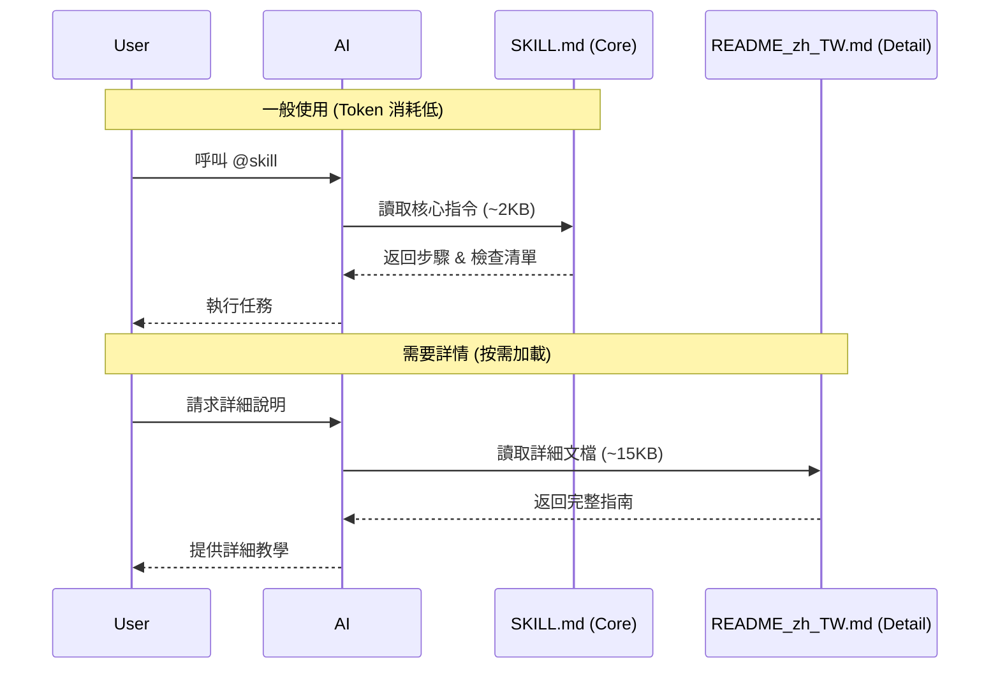

# 📁 Skill 結構與建立指南

每個 Skill 都是一個可執行的工作流程，旨在自動化任務、強化 AI 的技能或整合專案工具。

---

## 🏗️ 1. 理解 Skill 結構

一個完整的 Skill 由 **單一檔案 (SKILL.md)** 或 **資源目錄** 組成：

### YAML Metadata (標籤定義)
位於 `SKILL.md` 頂部，定義識別名稱與自動化觸發語境。

```yaml
---
name: skill-name              # 呼叫標籤 (例如: @tdd-workflow)
description: "何時使用..."    # 功用描述
model: sonnet                 # (可選) 建議使用的 AI 模型
---
```

### Instructions (核心指令)
包含任務的具體步驟、邏輯、檢查清單等核心內容。

### Resources (可選資源)
詳細說明文件、範例程式碼或模板檔案，供 AI 按需讀取以節省 Token。

---

## 📂 2. 標準目錄架構 (按需載入設計)

為了優化 Token 效能，建議採用以下結構：
```text
.claude/skills/my-skill/
├── SKILL.md              # 核心指令 (必讀, 2-5KB)
├── README_zh_TW.md       # 詳細手冊 (按需載入)
├── references.md         # 參考資料 (例如 API 列表、Commit 類型)
├── examples.md           # 使用範例 (或 examples/ 目錄)
└── scripts/              # 專用腳本 (如有需要)
```

### 官方推薦範例 (Official Reference)

參考 [Claude 官方最佳實踐](https://platform.claude.com/docs/en/agents-and-tools/agent-skills/best-practices)，扁平化結構有助於語意理解：

```text
pdf/
├── SKILL.md              # Main instructions (loaded when triggered)
├── FORMS.md              # Form-filling guide (loaded as needed)
├── reference.md          # API reference (loaded as needed)
├── examples.md           # Usage examples (loaded as needed)
└── scripts/
    ├── analyze_form.py   # Utility script (executed, not loaded)
    ├── fill_form.py      # Form filling script
    └── validate.py       # Validation script
```


### ⚡ 效能與 Token 優化 (Lazy Loading)

本架構將核心指令與詳細說明分離，大幅降低 Token 消耗。

#### 機制說明



#### 數據分析

| Skill | SKILL.md (Core) | README_zh_TW.md (Detail) | 預設消耗 | 按需消耗 | **節省率** |
| :--- | :--- | :--- | :--- | :--- | :--- |
| `tdd-workflow` | ~2 KB | ~10 KB | ~2 KB | ~12 KB | **83%** |
| `laravel-security-review` | ~9 KB | ~16 KB | ~9 KB | ~25 KB | **64%** |
| `flutter-openapi-generator` | ~12 KB | ~16 KB | ~12 KB | ~28 KB | **43%** |

> **平均節省率**: 60-80% (視詳細文檔大小而定)

---

## 🚀 3. 建立新 Skill 的步驟

### Step 1: 初始化
```bash
mkdir -p .claude/skills/my-skill
touch .claude/skills/my-skill/SKILL.md
```

### Step 2: 撰寫核心指令
在 `SKILL.md` 中定義 YAML 並編寫 Instructions。務必包含：
- **核心步驟**: AI 必須執行的具體動作。
- **檢查清單**: 任務完成的驗證標準。
- **資源參照**: 引導 AI 讀取詳細手冊 (如 `README_zh_TW.md`)。

### Step 3: 更新導覽與測試
在 [`.claude/skills/README.md`](README.md) 中註冊新 Skill，隨後在對話輸入 `@my-skill` 進行連動測試。

---

## 🔗 4. 整合模式 (Cookbook)

### 常用模式 A：執行自動化腳本
```markdown
1. **執行腳本**
   \```bash
   bash ../../agent-scripts/my-automation.sh
   \```
```

### 常用模式 B：引導式填寫模板
```markdown
1. **讀取模板**
   - 位置: `../../agent-scripts/templates/target.md`
2. **填寫內容**
   - 參考專家規範: `../../.claude/agents/laravel-expert.md`
```

### 常用模式 C：連動其他 Skill
在指令中明確提示：`「若檢測到安全性需求，請主動呼叫 @laravel-security-review。」`

---

## 💡 5. 最佳實踐精要

- **✅ 單一職責 (Single Responsibility)**: 一個 Skill 只解決一個痛點，避免過於臃腫。
- **✅ 延遲載入 (Lazy Loading)**: 將非核心的說明、範例移至 `README_zh_TW.md`，節省 60-80% Token。
- **✅ 相對路徑**: 始終使用 `../../` 引用 `agent-scripts` 或 `agents` 等共享資源。
- **✅ 主動引導**: 在指令結尾要求 AI 提供具體的「下一步建議」或「檢查結果回報」。
