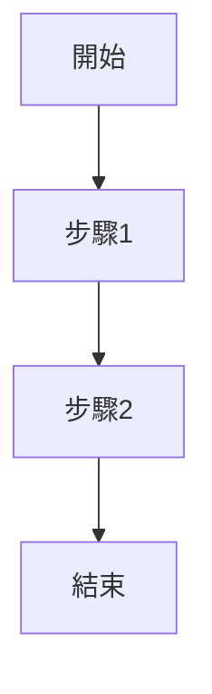

# 建立開發 Session

## 概述

此 skill 透過共享腳本與模板，自動化建立開發 session 的流程。

## 工作流程

### 1. 執行建立腳本

```bash
bash ../../agent-scripts/create-session.sh
```

**腳本功能**：
- 自動產生 session 檔案（格式：`YYYYMMDD_HHMM_<description>.md`）
- 使用 `../../agent-scripts/templates/session.md` 模板
- 儲存至 `docs/sessions/YYYY-MM/` 目錄

### 2. 填寫 Session 內容

使用模板填寫以下區塊：

#### Metadata
```yaml
---
Session: YYYYMMDD_HHMM
Title: [功能名稱]
Status: active | archived
Tags: [feature/xxx, screen/XXXScreen]
---
```

#### User Story
```markdown
## User Story

**As a** [角色]
**I want** [需求]
**So that** [目的]
```

#### User Flow (Mermaid)


### 3. 遵循專案規範

參考以下專家文檔：

- **Laravel 專案**: `../../agents/laravel-expert.md`
- **Flutter 專案**: `../../agents/flutter-expert.md`
- **Git Commit**: `../../agents/git-commit-tw.md`

### 4. 技術決策記錄

在 session 中記錄：

```markdown
## Technical Decisions

### Decision 1: [標題]
- **Context**: 為什麼需要做這個決定
- **Options**:
  - Option A: 優點 / 缺點
  - Option B: 優點 / 缺點
- **Decision**: 選擇 Option A
- **Rationale**: 原因說明
```

## 相關資源

### 共享腳本 (Scripts)
- `../../agent-scripts/create-session.sh` - 建立 session
- `../../agent-scripts/archive-session.sh` - 封存 session
- `../../agent-scripts/update-changelog.sh` - 更新 changelog

### 模板 (Templates)
- `../../agent-scripts/templates/session.md` - Session 模板
- `../../agent-scripts/templates/spec.md` - Spec 模板

### 專家規範 (Expert Docs)
- `../../agents/laravel-expert.md` - Laravel 開發規範
- `../../agents/flutter-expert.md` - Flutter 開發規範
- `../../agents/git-commit-tw.md` - Git Commit 規範

## 完成檢查清單

- [ ] Session 檔案已建立
- [ ] User Story 已填寫
- [ ] User Flow 已繪製（Mermaid）
- [ ] Technical Decisions 已記錄
- [ ] Tags 已標記（feature/screen）
- [ ] 遵循專案規範（參考專門專家文檔）

## 下一步

1. 開始開發（使用 `@tdd-workflow` skill）
2. 定期更新 session 進度
3. 完成後執行 `bash ../../agent-scripts/archive-session.sh`
