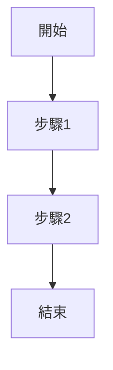

# 建立開發 Session

## 概述

在「程式碼開發專案」中建立一份開發 session 文件，記錄需求、流程與技術決策。
此 skill 為**純指令式**：不依賴任何外部 shell 腳本，由 AI 直接偵測目錄、產生檔名並套用下方內嵌模板。

> [!note]
> **適用範圍**：本 skill 用於**開發專案**（Laravel / Flutter 等程式碼 repo）的 `docs/sessions/`。
> 若是要在 Obsidian vault 的 `1_Projects/` 建立專案 session 筆記，請改用 `obsidian-add-projects-session` skill。

## 工作流程

### 1. 決定 Session 檔案位置與檔名

**偵測目錄**（依序）：
1. 當前目錄若有 `sessions/` → 用它
2. 否則找 `docs/sessions/`（不存在則建立）
3. 在其下以年月分組：`docs/sessions/YYYY-MM/`

**檔名格式**：`YYYYMMDD_HHMM_<kebab-description>.md`
（例：`20260614_0930_account-deletion-api.md`）

### 2. 套用內嵌模板

依下方模板建立檔案內容。

**⚠️ 重要規則 (Critical Rules)**：
1. **語言**：內文必須使用 **繁體中文**。
2. **標題**：Level 1-2 (`#`, `##`) 保持英文；Level 3+ (`###`) 推薦中英對照（例：`### Approach Analysis (方案分析)`）。
3. **格式**：必須保留 Metadata 區塊。

```markdown
---
Session: YYYYMMDD_HHMM
Title: [功能名稱]
Status: active | archived
Tags: [feature/xxx, screen/XXXScreen]
---

# [功能名稱]

## User Story

**As a** [角色]
**I want** [需求]
**So that** [目的]

## User Flow


```mermaid
graph TD
    A[開始] --> B[步驟1]
    B --> C[步驟2]
    C --> D[結束]
```

## Technical Decisions

### Decision 1: [標題]
- **Context**: 為什麼需要做這個決定
- **Options**:
  - Option A: 優點 / 缺點
  - Option B: 優點 / 缺點
- **Decision**: 選擇 Option A
- **Rationale**: 原因說明

## Progress

- [ ] ...
```

### 3. 遵循專案規範（按需深讀）

開始填寫技術決策與後續開發時，依專案類型參考對應的專家規範文件
（精簡規範在 expert，完整規範與程式碼範例在 conventions，依需要深讀）：

- **Laravel 專案**：`../../agents/laravel-expert.md` → `../../agents/laravel-conventions.md`
- **Flutter 專案**：`../../agents/flutter-expert.md` → `../../agents/flutter-conventions.md`

## 完成檢查清單

- [ ] Session 檔案已建立（路徑 + 檔名格式正確）
- [ ] Metadata 區塊完整
- [ ] User Story 已填寫
- [ ] User Flow 已繪製（Mermaid）
- [ ] Technical Decisions 已記錄
- [ ] Tags 已標記（feature/screen）
- [ ] 已參考對應專案的專家規範

## 下一步

1. 開始開發（可搭配 `@tdd-workflow` skill）
2. 定期更新 session 的 Progress 區塊
3. 完成後將 Metadata 的 `Status` 改為 `archived`
4. 視需要執行 `@update-changelog` skill 更新 CHANGELOG
