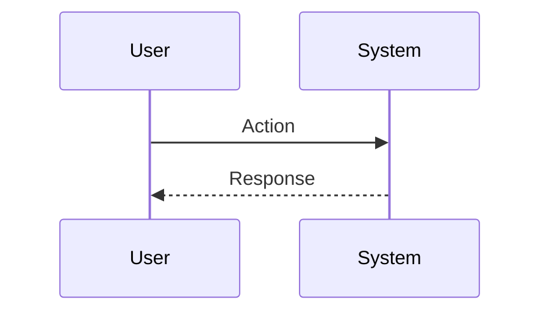

# Session: {{title}}

## 🎯 Overview

<!-- 此 Session 要達成什麼目標？解決什麼問題？ -->

### Related Documents

<!-- 相關的 PRD、Feature Spec、其他 Session -->
- [[]] -

### User Flow

## 🔍 Analysis

<!-- 問題分析、技術調研、方案評估 -->

### Option A: [方案名稱] [✅ CHOSEN | ❌ REJECTED]

**Pros**:
-

**Cons**:
-

### Option B: [方案名稱] [✅ CHOSEN | ❌ REJECTED]

**Pros**:
-

**Cons**:
-

## ✅ Decision

<!-- 最終採用的方案、架構決策、實作策略 -->
<!-- Decision Rationale: 為什麼選這個方案？放棄了什麼？ -->

## 📋 Implementation Checklist

- [ ] 任務 1
- [ ] 任務 2
- [ ] 任務 3

## 💻 Related Code

<!-- 相關的檔案路徑、類別、函數 -->

## ⚠️ Blockers & Pitfalls

<!-- 擋住進度的阻礙與解法、踩過的坑與注意事項 -->

## 📊 Outcome

<!-- 完成後填寫：做了什麼、改了哪些檔案 -->

## 🎓 Lessons Learned

<!-- 這次學到什麼？未來遇到類似問題該怎麼做？ -->

## 🔗 References

<!-- 連結到相關的知識卡片、文檔、外部資源 -->
- [[]] -

## ⏭️ Follow-ups

<!-- 完成後的後續工作、衍生任務、刻意不做的事 -->
